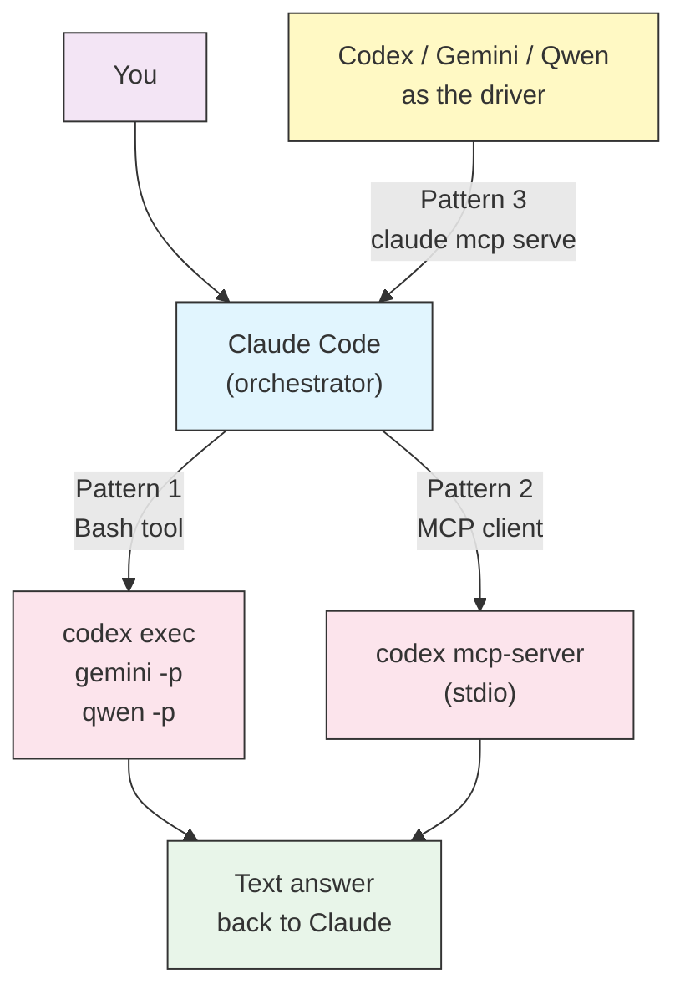

# External CLI Agents (Codex, Gemini, Qwen)

Claude Code does not have to be the only agent in your terminal. OpenAI's Codex CLI, Google's Gemini CLI, and Alibaba's Qwen Code all run headlessly, which means Claude Code can call them the same way it calls `grep` or `pytest` — and hand their answers back to you inside one session.

This guide covers three integration patterns, when each is worth the setup cost, and the authentication changes in 2026 that break older tutorials.

> **Important**: Every command here sends your prompt (and often your source files) to a third-party provider. Treat it like any other outbound data transfer — check your organization's policy before wiring a second vendor into your coding loop.

---

## Why Bother

Claude Code is the orchestrator. The external CLI is a tool it calls. You are not switching editors — you are widening the pool of models that can answer a single question.

| Reason | What it looks like in practice |
|--------|-------------------------------|
| **Second opinion** | Ask a different model family to review a design before you commit to it. Independent training data means independent blind spots. |
| **Context offloading** | Send a 4,000-file directory scan to another CLI and get back a 20-line summary. Claude Code's context holds the summary, not the scan. |
| **Cost arbitrage** | Route bulk, low-stakes work (changelog drafts, docstring passes) to a cheaper model and keep Claude Code on the reasoning. |
| **Cross-checking output** | Two agents that independently agree on a fix is a stronger signal than one agent that is confident. |

**When it is not worth it**: single-file edits, anything where the round trip costs more than doing the work, and any task where you would not read the second opinion anyway.

---

## Integration Patterns



Claude Code reaches external agents two ways (shell out, or speak MCP to them), and external agents can reach back into Claude Code via `claude mcp serve`.

| Pattern | Setup cost | Best for |
|---------|-----------|----------|
| **1. Bash delegation** | Minutes | Everything, unless you have a reason not to. Works with all three CLIs. |
| **2. MCP client** | Moderate | Codex only — it ships a native MCP server mode with session continuity. |
| **3. Reverse (`claude mcp serve`)** | Moderate | When the other CLI is driving and you want Claude Code as its sub-agent. |

---

## Before You Start: 2026 Authentication Reality

Two of these three CLIs removed their free tiers in 2026. Tutorials written before then will fail at the auth step.

| CLI | Package / binary | Status as of July 2026 |
|-----|-----------------|------------------------|
| **Codex CLI** | `@openai/codex` / `codex` | Active. Sign in with a ChatGPT plan, or set `OPENAI_API_KEY`. |
| **Gemini CLI** | `@google/gemini-cli` / `gemini` | Repo is still open source (Apache-2.0) and still shipping releases. But on **June 18, 2026** Google stopped serving Gemini CLI requests for Google AI Pro, Ultra, and free Code Assist individual accounts. A paid `GEMINI_API_KEY` (AI Studio), Vertex AI credentials, or a Code Assist Standard/Enterprise license still work. Google's stated successor for individuals is **Antigravity CLI** (binary `agy`). |
| **Qwen Code** | `@qwen-code/qwen-code` / `qwen` | Active. The **Qwen OAuth free tier was discontinued on 2026-04-15**. Use Alibaba ModelStudio, or point it at any OpenAI-compatible provider with `OPENAI_API_KEY` / `OPENAI_BASE_URL` / `OPENAI_MODEL`. |

Install whichever you plan to use:

```bash
# OpenAI Codex CLI
npm install -g @openai/codex

# Google Gemini CLI (requires paid API key or Code Assist Standard/Enterprise)
npm install -g @google/gemini-cli

# Qwen Code (requires ModelStudio or an OpenAI-compatible provider)
npm install -g @qwen-code/qwen-code@latest
```

Verify each one answers before you wire it into Claude Code:

```bash
codex exec "reply with the single word: ok"
gemini -p "reply with the single word: ok"
qwen -p "reply with the single word: ok"
```

If a CLI hangs or returns an auth error here, fix it now — debugging it through two layers of agent indirection is much harder.

---

## Pattern 1: Bash Delegation

The simplest pattern, and the one to reach for first. Claude Code runs the other CLI as a shell command and reads its stdout.

### The headless flags that matter

| CLI | Non-interactive form | Structured output | Safety control |
|-----|---------------------|-------------------|----------------|
| Codex | `codex exec "prompt"` | `--json` | `--sandbox read-only` (default), `workspace-write`, `danger-full-access` |
| Gemini | `gemini -p "prompt"` | `--output-format json` | `--approval-mode` (avoid `--yolo`) |
| Qwen | `qwen -p "prompt"` | `--output-format json` | `--approval-mode` (avoid `--yolo`) |

Qwen Code is a fork of Gemini CLI, so its flags track Gemini's closely.

Keep every delegated call **read-only**. You want an opinion, not a second agent editing your working tree behind Claude Code's back:

```bash
# Ask Codex to review, not to edit
codex exec --sandbox read-only "Review src/auth/session.py for race conditions. Do not modify files."
```

### Allowlist the commands

Without this, every delegation triggers a permission prompt. Add to `.claude/settings.json`:

```json
{
  "permissions": {
    "allow": [
      "Bash(codex exec:*)",
      "Bash(gemini -p:*)",
      "Bash(qwen -p:*)"
    ]
  }
}
```

> **Warning**: Only allowlist the read-only invocations. Never allowlist `codex exec --sandbox danger-full-access`, `gemini --yolo`, or `qwen --yolo` — those let a second agent make unreviewed changes with your approval already granted.

### Use a wrapper script

Calling the CLIs directly works, but a wrapper gives you timeouts, consistent errors, and one place to change models. Copy [`ask-external-agent.sh`](ask-external-agent.sh) into your project:

```bash
mkdir -p .claude/scripts
cp 09-advanced-features/ask-external-agent.sh .claude/scripts/
chmod +x .claude/scripts/ask-external-agent.sh
```

Then allowlist the single wrapper instead of three raw commands:

```json
{
  "permissions": {
    "allow": ["Bash(.claude/scripts/ask-external-agent.sh:*)"]
  }
}
```

Usage:

```bash
# .claude/scripts/ask-external-agent.sh <codex|gemini|qwen> "<prompt>"
.claude/scripts/ask-external-agent.sh codex "Is this migration reversible? See migrations/0042_add_index.sql"
```

The wrapper enforces a timeout (external agents can think for minutes), fails loudly if the CLI is not installed, and returns a non-zero exit code Claude Code can react to.

---

## Pattern 2: Codex as an MCP Server

Codex CLI ships a server mode: `codex mcp-server` starts a JSON-RPC server on stdio and exposes Codex as MCP tools — `codex` to start a session and `codex-reply` to continue one by thread ID. That session continuity is the real advantage over Pattern 1: you can ask a follow-up without re-sending the whole context.

> **Note**: The `codex mcp` command family is marked experimental by OpenAI. Command names and config format can change between releases.

Register it with Claude Code:

```bash
claude mcp add --transport stdio codex -- codex mcp-server
```

Or add it to `.mcp.json` so the whole team picks it up. See [`external-cli-mcp.json`](external-cli-mcp.json) for a ready-to-copy version:

```bash
cp 09-advanced-features/external-cli-mcp.json .mcp.json
```

Verify the connection:

```bash
claude mcp list
```

**Gemini CLI and Qwen Code have no documented MCP server endpoint.** Both are MCP *clients* — they consume MCP servers (`gemini mcp add`, `qwen mcp add`) but do not expose themselves as one. (Qwen Code ships an experimental `qwen serve` daemon, but it is an HTTP+SSE service for its own clients, not an MCP endpoint for Claude Code.) For those two, use Pattern 1, or a community wrapper that shells out to the CLI and re-exposes it as MCP. Community wrappers are unaudited third-party code sitting between your codebase and a model provider; read the source before installing one.

---

## Pattern 3: The Reverse Direction

Sometimes the other CLI is the driver — a Codex-based pipeline that wants Claude Code's opinion, for instance. Claude Code can serve itself over MCP:

```bash
claude mcp serve
```

Register it from the other side:

```bash
# From Codex
codex mcp add claude -- claude mcp serve

# From Gemini CLI
gemini mcp add claude claude mcp serve

# From Qwen Code
qwen mcp add claude claude mcp serve
```

This is also how you avoid a common trap: if you register Claude Code inside Gemini *and* Gemini inside Claude Code, a poorly-worded prompt can bounce between them. Pick one direction per workflow.

---

## One Set of Instructions, Four Agents

Each CLI reads a different instructions file by default:

| Agent | Instructions file |
|-------|------------------|
| Claude Code | `CLAUDE.md` |
| Codex CLI | `AGENTS.md` |
| Gemini CLI | `GEMINI.md` |
| Qwen Code | `QWEN.md` |

Maintaining four copies of your conventions guarantees they drift. Claude Code does not read `AGENTS.md` natively, but it does support imports — so make `AGENTS.md` the shared source of truth and have the others point at it.

```bash
# AGENTS.md holds the conventions every agent needs
# CLAUDE.md imports it, then adds Claude-specific rules
cat > CLAUDE.md <<'EOF'
@AGENTS.md

## Claude Code specifics

- Use the Task tool for multi-file refactors.
- Never commit without an explicit request.
EOF

# Gemini and Qwen read theirs verbatim — symlink instead of copying
ln -s AGENTS.md GEMINI.md
ln -s AGENTS.md QWEN.md
```

Keep the shared file model-agnostic: build commands, directory layout, test invocation, code style. Anything that names a specific tool's features belongs in that tool's own file.

---

## Practical Examples

### Example 1: Second-opinion subagent

Delegating to an external CLI burns context — the prompt, the answer, and the shell noise all land in your main conversation. A subagent absorbs that in an isolated context and returns only the verdict.

Copy [`second-opinion.md`](second-opinion.md) into your project:

```bash
mkdir -p .claude/agents
cp 09-advanced-features/second-opinion.md .claude/agents/
```

Then ask for it by name:

```text
Use the second-opinion agent to check whether the retry logic in
src/queue/worker.py can drop messages under network partition.
```

The subagent runs the external CLI, reads the full response, and reports back a short summary. Your main context stays clean.

### Example 2: Reviewing a large diff cheaply

```bash
# Claude Code decides the diff is large and offloads the first pass
git diff main...HEAD | qwen -p "List every function whose behavior changed. Names only, one per line."
```

Claude Code then reads only the function list and does the careful review on those functions — instead of loading the whole diff.

### Example 3: Cross-checking a security finding

```text
You flagged a possible SQL injection in src/reports/query_builder.py:88.
Run it past Codex with the read-only sandbox and tell me whether it agrees,
and where the two analyses differ.
```

Disagreement between two model families is the useful output here. It tells you exactly which line deserves a human look.

### Example 4: A slash command for repeatable delegation

Create `.claude/commands/cross-check.md`:

```markdown
---
description: Get a second opinion from an external CLI agent on the current changes
argument-hint: "[codex|gemini|qwen]"
allowed-tools: Bash, Read
---

Run the current branch's diff past $1 (default: codex) and report back.

1. Capture the diff with `git diff main...HEAD`.
2. Pipe it to the external agent, asking for correctness risks only.
3. Summarize where the external agent agrees with your own reading and
   where it disagrees. Flag disagreements first — they matter most.
4. Do not apply any changes the external agent suggests. Report only.
```

Invoke with `/cross-check gemini`.

---

## Best Practices

| Do | Don't |
|----|-------|
| Keep every delegated call read-only | Let a second agent write to your working tree |
| Set a timeout on every external call | Let a hung CLI block the session indefinitely |
| Run delegation through a subagent | Dump raw CLI output into your main context |
| Verify each CLI works standalone first | Debug auth failures through two layers of agent |
| Ask for short, structured answers | Ask open-ended questions that return essays |
| Pick one direction per workflow | Register each agent inside the other |
| Check your data-handling policy first | Send proprietary code to a second vendor by reflex |

### Cost control

Every delegation is a second billable inference on top of Claude Code's own. Two habits keep that in check: constrain the output ("names only, one per line" beats "review this"), and delegate at decision points rather than continuously. A second opinion on an architectural choice earns its cost; a second opinion on every edit does not.

---

## Troubleshooting

### The CLI hangs and never returns

It is waiting for input. All three CLIs enter interactive mode when they detect a TTY or when a required flag is missing. Confirm you passed `exec` (Codex) or `-p` (Gemini, Qwen), and always wrap the call in `timeout`.

### Auth errors that used to work

Check the [authentication table](#before-you-start-2026-authentication-reality). If `gemini` started returning HTTP 410, you are on a retired free or Pro/Ultra tier — move to a paid API key, a Code Assist Standard/Enterprise license, or Antigravity CLI. If `qwen` rejects a cached OAuth token, the free tier ended on 2026-04-15; configure ModelStudio or an OpenAI-compatible provider.

### Empty output when Claude Code calls it, but fine by hand

The CLI is detecting a non-TTY and behaving differently. Antigravity CLI (`agy`) has a known variant of this where headless `-p` produces no stdout. Force structured output (`--json` / `--output-format json`) and parse that, rather than relying on the human-readable stream.

### A permission prompt on every call

Your allowlist pattern does not match the actual command. `Bash(codex:*)` will not match a call the agent writes as `timeout 120 codex exec ...`. Route everything through the wrapper script and allowlist that one path.

### MCP server shows as failed

Run `claude mcp list` for the status, then try the server standalone: `npx @modelcontextprotocol/inspector codex mcp-server`. If it fails there too, the problem is in the Codex install or its `~/.codex/config.toml`, not in Claude Code.

---

## Related Guides

- [MCP Protocol](../05-mcp/README.md) - Registering and managing MCP servers
- [Subagents](../04-subagents/README.md) - Isolated contexts for delegated work
- [Memory](../02-memory/README.md) - How `CLAUDE.md` imports work
- [Slash Commands](../01-slash-commands/README.md) - Wrapping delegation in a command
- [Advanced Features](README.md) - Headless mode, permission modes, sandboxing

---

## Additional Resources

- [Codex CLI documentation](https://developers.openai.com/codex/cli)
- [Gemini CLI repository](https://github.com/google-gemini/gemini-cli)
- [Qwen Code documentation](https://qwenlm.github.io/qwen-code-docs/)
- [Model Context Protocol specification](https://modelcontextprotocol.io)

---
**Last Updated**: July 30, 2026
**Claude Code Version**: 2.1.217
**Sources**:
- https://code.claude.com/docs/en/mcp
- https://developers.openai.com/codex/cli
- https://github.com/google-gemini/gemini-cli
- https://qwenlm.github.io/qwen-code-docs/en/users/configuration/auth/
**Compatible Models**: Claude Sonnet 5, Claude Sonnet 4.6, Claude Opus 4.8, Claude Haiku 4.5
